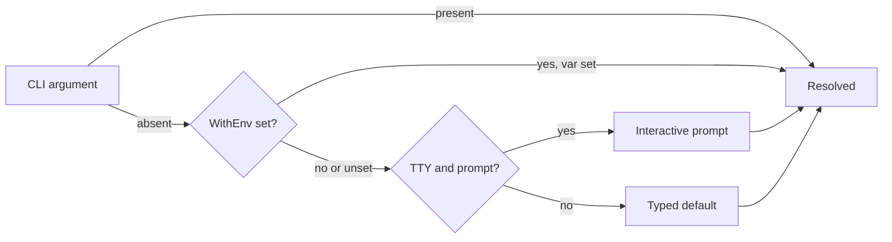
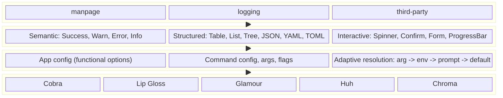

<!-- TODO: drop a logo at docs/assets/logo.svg — a crystal on a thread in the Nabat palette works well. -->
<!--  -->

# Nabat

*From Persian نبات "rock candy"; /næˈbɑːt/ (nah-BAHT).*

**Adaptive CLI framework for Go.**
*Interactive input · Structured output · Built-in themes.*

[](https://github.com/nabat-dev/nabat/actions/workflows/ci.yml)
[](https://pkg.go.dev/nabat.dev)
[](https://goreportcard.com/report/nabat.dev)
[](https://codecov.io/gh/nabat-dev/nabat)
[](go.mod)
[](LICENSE)

<details>
<summary>Table of contents</summary>

- [What is Nabat?](#what-is-nabat)
- [Why Nabat?](#why-nabat)
- [Features](#features)
- [Install](#install)
- [Quick Start](#quick-start)
- [User Guide](#user-guide)
  - [Coming from Cobra?](#coming-from-cobra)
  - [The App](#the-app)
  - [Commands](#commands)
  - [Positional Args](#positional-args)
  - [Flags](#flags)
  - [Binding resolved values](#binding-resolved-values)
  - [Prompts](#prompts)
  - [Lifecycle Hooks](#lifecycle-hooks)
  - [Semantic Output](#semantic-output)
  - [Structured Output](#structured-output)
  - [Interactive Output](#interactive-output)
  - [Help](#help)
  - [Version](#version)
  - [Shell Completion](#shell-completion)
  - [Themes](#themes)
  - [Errors](#errors)
  - [Common Pitfalls](#common-pitfalls)
- [Extensions](#extensions)
  - [Built-in Extensions](#built-in-extensions)
  - [Writing Your Own Extension](#writing-your-own-extension)
- [Testing](#testing)
- [Examples](#examples)
- [Subpackages](#subpackages)
- [Architecture](#architecture)
- [Brand Story](#brand-story)
- [Acknowledgments](#acknowledgments)
- [Development](#development)
- [Contributing](#contributing)
- [License](#license)

</details>

---

## What is Nabat?

Nabat is an adaptive CLI framework for Go: typed positional args that resolve from CLI to env var to interactive prompt, structured output that stays pipe-friendly, and twelve built-in themes — all on [Cobra](https://github.com/spf13/cobra)'s command router.

The name comes from Persian rock candy.
Sugar crystals grow slowly around a simple thread.
Nabat works the same way: start with a strong core, then add layers one by one.
Read more in the [Brand Story](#brand-story).

---


## Why Nabat?

| You want...                                  | Nabat gives you...                                                     |
|----------------------------------------------|------------------------------------------------------------------------|
| To keep Cobra under the hood                 | The full Cobra API is still there. Nabat wraps it, not replaces it.    |
| Less boilerplate for flags and args          | Functional options with safe defaults. One call sets up a flag or arg. |
| Args that work in scripts **and** for humans | `arg -> env -> prompt -> default` resolution (adaptive args).          |
| Pretty output that does not break pipes      | Semantic helpers that pick the right stream and respect `NO_COLOR`.    |
| Built-in help, version, and shell completion | One option each. Opt-in, easy to customize.                            |
| Themes that feel right out of the box        | Twelve built-in themes, or bring your own.                             |
| Clear errors when you set things up wrong    | All setup errors come back together from `New` as one value.           |

**Nabat is not for you if:**

- You need a zero-dependency library. Nabat uses `Cobra`, `Lip Gloss`, `Huh`, `Glamour`, and `Chroma`.
- You want to replace Cobra's flag parser. Nabat delegates all flag work to `Cobra` and `pflag`.

---

## Features

- **Cobra inside.** No new flag parser. No new completion engine. Same battle-tested core.
- **Typed args and flags.** Define them with options. Copy them into a struct with `c.Bind` and handle its returned `error`.
- **Adaptive args.** Each positional arg resolves from CLI, then env var, then prompt, then default – in that order.
- **Styled help and version.** `--help` / `-h` is on by default. Version is opt-in with `WithVersion`.
- **Shell completion.** Bash, Zsh, Fish, PowerShell – one line: `WithCompletion()`.
- **Semantic output.** `c.Success`, `c.Warn`, `c.Error`, `c.Info` -- each goes to the right stream and uses the theme.
- **Structured output.** `c.Table`, `c.List`, `c.Tree`, `c.JSON`, `c.YAML`, `c.TOML`, `c.Encode`, `c.Highlight`, `c.Markdown`, `c.ProgressBar`.
- **Interactive layer.** `c.Spinner`, `c.Confirm`, `c.Form` -- all built on [Huh](https://pkg.go.dev/charm.land/huh/v2) (`charm.land/huh/v2`).
- **Twelve built-in themes.** Popular light and dark palettes (including Catppuccin, Dracula, Gruvbox, Nord, and Solarized) plus the Nabat brand theme. You can change one token at a time or bring a full custom theme.
- **Pipe-friendly by default.** Honors `NO_COLOR`, `CLICOLOR`, `CLICOLOR_FORCE`, `TERM=dumb`, and TTY detection.
- **Fail fast.** Setup errors come back together as one `*ConfigErrors` from `New`.
- **Test helpers.** The `nabattest` package runs your CLI inside `*testing.T` with explicit args.

---

## Install

Requires **Go 1.26** or newer.

```bash
go get nabat.dev
```

Tagged releases follow [semantic versioning](https://semver.org/). The public Go API is extended additively (new `With*` options and types) as described in the [design principles](docs/design-principles.md).

The module is `nabat.dev`. The core package and optional features live in subpackages:

```go
import (
    "nabat.dev/nabat"      // core: app, commands, args, output, IOStreams, themes, help, version, completion
    "nabat.dev/theme"      // theme constants and recipes
    "nabat.dev/manpage"    // man page generation (extension)
    "nabat.dev/logging"    // themed slog logger (extension)
    "nabat.dev/nabattest"  // test helpers: NewIO, NewTTYIO, Run, RunParallel
)
```

---

## Quick Start

A full CLI -- root config and all subcommands -- fits in one `nabat.New(...)` call:

```go
package main

import (
    "context"
    "log"
    "os"

    "nabat.dev/nabat"
    "nabat.dev/manpage"
)

func main() {
    type deployArgs struct {
        Environment string `nabat:"environment"`
        Replicas    int    `nabat:"replicas"`
    }

    app, err := nabat.New("myctl",
        nabat.WithDescription("My CLI tool"),
        nabat.WithVersion("0.1.0"),
        nabat.WithCompletion(),
        nabat.WithExtension(manpage.New()),

        nabat.WithCommand("deploy",
            nabat.WithDescription("Deploy an application"),
            nabat.WithSelectArg("environment", "",
                []string{"staging", "production"},
                nabat.WithRequired(),
                nabat.WithPrompt("Target environment", "",
                    nabat.WithHint("staging"),
                ),
            ),
            nabat.WithFlag("replicas", 2, nabat.WithUsage("Number of replicas")),
            nabat.WithRun(func(c *nabat.Context) error {
                var args deployArgs
                if err := c.Bind(&args); err != nil {
                    return err
                }
                c.Success("deployed",
                    "environment", args.Environment,
                    "replicas", args.Replicas,
                )
                return nil
            }),
        ),
    )
    if err != nil {
        log.Fatal(err)
    }

    if err := app.Run(context.Background()); err != nil {
        os.Exit(1)
    }
}
```

Try it:

```bash
go run . deploy           # prompts for environment (TTY)
go run . deploy staging   # uses the CLI arg
go run . deploy --help    # styled, themed help
go run . --version        # prints 0.1.0
go run . completion bash  # shell completion script
```

---

## User Guide

Each section below teaches one part of Nabat.
Code examples are short and ready to run.

### Coming from Cobra?

You keep **routing, flags, and shell completion** from Cobra.
Nabat wraps the root command and adds typed options, adaptive args, themes, prompts, and output helpers on top.
When you need the underlying tree, use `App.UnsafeRoot()` for the `*cobra.Command`.
A practical path is to mirror your existing commands with `WithCommand`, then introduce `Bind` and semantic output where they pay off.

### The App

`nabat.New` builds an app and returns it with any errors.
`nabat.MustNew` does the same but panics on error -- useful in tests and `main()` when you do not want to check.

```go
app, err := nabat.New("myctl",
    nabat.WithDescription("My CLI tool"),
    nabat.WithEnvPrefix("MYAPP_"),
    nabat.WithErrorHandler(func(err error) {
        fmt.Fprintf(os.Stderr, "oops: %v\n", err)
    }),
)
if err != nil {
    log.Fatal(err)
}
```

Key root options:

| Option                      | What it does                                                                                           |
|-----------------------------|--------------------------------------------------------------------------------------------------------|
| `WithDescription(text)`     | One-line description shown in help.                                                                    |
| `WithLongDescription(text)` | Detailed description shown in full help.                                                               |
| `WithEnvPrefix(prefix)`     | Prefix for env var lookup. Default: `UPPER(name)_` — for an app named `myctl` the default is `MYCTL_`. |
| `WithIO(streams)`           | Replace the IO bundle. Tests use `nabattest.NewIO()`.                                                  |
| `WithErrorHandler(fn)`      | Custom error display when `App.Run` fails.                                                             |
| `WithLogger(logger)`        | Set a `*slog.Logger` for `Context.Logger()`.                                                           |

### Commands

Use `WithCommand` inside `New` to declare subcommands.
All errors from every option come back together in one `*ConfigErrors`.

```go
app, err := nabat.New("myctl",
    nabat.WithCommand("cluster",
        nabat.WithDescription("Cluster management"),
        nabat.WithCommand("scale", nabat.WithRun(scaleHandler)),
        nabat.WithCommand("status", nabat.WithRun(statusHandler)),
    ),
    nabat.WithCommand("deploy",
        nabat.WithDescription("Deploy an application"),
        nabat.WithAliases("dep"),
        nabat.WithGroup("Operations"),
        nabat.WithRun(deployHandler),
    ),
)
```

For runtime registration (plugins, dynamic config), use `App.Command` or `App.MustCommand`:

```go
app, _ := nabat.New("myctl")
cmd, err := app.Command("serve", nabat.WithRun(serveHandler))

// or panic on error (good for main):
app.MustCommand("serve", nabat.WithRun(serveHandler))
```

Nested subcommands work the same way on a `*Command`:

```go
cluster := app.MustCommand("cluster", nabat.WithDescription("Cluster ops"))
cluster.MustCommand("scale", nabat.WithRun(scaleHandler))
```

More command options:

| Option                     | What it does                                                  |
|----------------------------|---------------------------------------------------------------|
| `WithAliases("dep", "d")`  | Command aliases for lookup and suggestions.                   |
| `WithGroup("Operations")`  | Group commands in help output.                                |
| `WithHidden()`             | Hide from help but keep it usable.                            |
| `WithTypoHints("deploay")` | Suggest this command when the user makes a typo.              |
| `WithAnnotation(key, val)` | Set a Cobra annotation.                                       |
| `WithExample(shell)`       | Example block in help. Uses shell syntax highlighting on TTY. |

### Positional Args

A positional arg is a value the user passes by position, not by name.
For example: `myctl deploy staging` -- here `staging` is a positional arg.

Define args with `WithArg`, `WithSelectArg`, or `WithMultiSelectArg`:

```go
nabat.WithCommand("greet",
    nabat.WithArg("name", "world",
        nabat.WithPrompt("Your name", "",
            nabat.WithHint("alice"),
        ),
    ),
    nabat.WithSelectArg("format", "text", []string{"text", "json"},
        nabat.WithPrompt("Output format", "",
            nabat.WithHint("text"),
        ),
    ),
    nabat.WithRun(func(c *nabat.Context) error {
        name, err := nabat.BindAs[string](c, "name")
        if err != nil {
            return err
        }
        format, err := nabat.BindAs[string](c, "format")
        if err != nil {
            return err
        }
        c.Success("hello", "name", name, "format", format)
        return nil
    }),
)
```

`WithArg` works with generics. The type of the default value sets the arg type:

```go
nabat.WithArg("count", 3)           // int arg, default 3
nabat.WithArg("name", "world")      // string arg, default "world"
nabat.WithArg("verbose", false)     // bool arg, default false
```

`WithMultiSelectArg` lets the user pick one or more values from a list. The resolved value is a `[]string`:

```go
nabat.WithMultiSelectArg("services", []string{"web"}, []string{"web", "db", "cache"},
    nabat.WithRequired(),
    nabat.WithPrompt("Services to deploy", "",
        nabat.WithDefault([]string{"web"}),
    ),
)
// In the handler:
services, err := nabat.BindAs[[]string](c, "services")
```

> **Required args in non-TTY environments (CI, pipes):** when `WithRequired()` is set and stdin is not a terminal, Nabat returns an error instead of prompting. Provide the value via a CLI arg or add `WithEnv("KEY")` so it can also come from an environment variable.

#### Adaptive Resolution

Each positional arg resolves in this order.
The first source that provides a value wins.



1. **CLI argument** – the user passes it on the command line.
2. **Env var** -- only if you added `WithEnv` to the arg. The env var name is built from the app prefix plus the key.
3. **Interactive prompt** – only if stdin is a TTY and you declared a prompt (with `WithPrompt`).
4. **Typed default** – the value you passed to `WithArg` or `WithSelectArg`.


### Flags

A flag is a named value the user passes with `--name` or `-n`.
Define flags with `WithFlag`, `WithSelectFlag`, or `WithMultiSelectFlag`:

```go
nabat.WithFlag("replicas", 2,
    nabat.WithShort('r'),
    nabat.WithUsage("Number of replicas"),
    nabat.WithEnv("replicas"),
    nabat.WithPersistent(),
)
```

`WithFlag` is generic. The type of the default sets the flag type:

```go
nabat.WithFlag("verbose", false, nabat.WithShort('v'))      // bool flag
nabat.WithFlag("output", "table", nabat.WithShort('o'))     // string flag
nabat.WithFlag("port", 8080)                                // int flag
```

`WithSelectFlag` restricts the value to a fixed list of choices:

```go
nabat.WithSelectFlag("output", "table", []string{"table", "json", "yaml"},
    nabat.WithShort('o'),
    nabat.WithUsage("Output format"),
)
// In the handler:
format, err := nabat.BindAs[string](c, "output")
```

`WithMultiSelectFlag` allows picking one or more values from a list. The resolved value is a `[]string`:

```go
nabat.WithMultiSelectFlag("regions", []string{"us"}, []string{"us", "eu", "ap"},
    nabat.WithUsage("Target regions"),
)
// In the handler:
regions, err := nabat.BindAs[[]string](c, "regions")
```

Flag-only options:

| Option              | What it does                                               |
|---------------------|------------------------------------------------------------|
| `WithShort('r')`    | Short flag: `-r` instead of `--replicas`.                  |
| `WithRequired()`    | Fail if the flag is not provided (no default is accepted). |
| `WithPersistent()`  | Flag is available on this command and all children.        |
| `WithCompleter(fn)` | Dynamic shell completion for this flag.                    |
| `WithHidden()`      | Hide from help but keep it usable.                         |

#### Environment Variables

Use `WithEnv` to read a flag or arg from the environment.
The first name you give is combined with the app's env prefix.
Extra names from `WithEnvAlias` are used as-is:

```go
nabat.New("deployctl",
    nabat.WithEnvPrefix("DEPLOYCTL_"),
    nabat.WithCommand("deploy",
        nabat.WithFlag("tag", "latest",
            nabat.WithEnv("tag"),                 // reads DEPLOYCTL_TAG
            nabat.WithEnvAlias("DEPLOY_TAG"),     // also reads DEPLOY_TAG
        ),
    ),
)
```

#### Deprecation

Mark a flag or command as deprecated so users know to move on:

```go
nabat.WithFlag("config", "",
    nabat.WithShort('c'),
    nabat.WithDeprecated("use --settings instead",
        nabat.WithDeprecatedSince("v0.7.0"),
        nabat.WithDeprecatedReplacement("--settings"),
    ),
)
```

`WithDeprecatedShorthand` marks only the short form as deprecated:

```go
nabat.WithFlag("config", "",
    nabat.WithShort('c'),
    nabat.WithDeprecatedShorthand("use --config instead of -c"),
)
```

### Binding resolved values

Handlers read resolved args and flags with [`Context.Bind`](https://pkg.go.dev/nabat.dev/nabat#Context.Bind) or [`BindAs`](https://pkg.go.dev/nabat.dev/nabat#BindAs). Prefer **`Bind`** when you want several names at once and a single error return; use **`BindAs`** for one name with an explicit type (including in tests).

**`Bind`** tags struct fields with `nabat:"name"` (the declared arg or flag name). Untagged fields are skipped; anonymous embedded structs without a tag are walked. Value fields are filled whenever a resolved value exists (including defaults). Pointer fields (`*int`, `*string`, …) stay `nil` when the user did not supply the value (CLI, env, or prompt) and it came only from a default — use them when you need to distinguish “explicit” from “default”. `Bind` returns an error for invalid targets, type mismatches, or tags that name nothing declared on the command.

```go
nabat.WithRun(func(c *nabat.Context) error {
    var args struct {
        Environment string `nabat:"environment"`
        Replicas    int    `nabat:"replicas"`
        Verbose     bool   `nabat:"verbose"`
    }
    if err := c.Bind(&args); err != nil {
        return err
    }
    c.Success("deployed", "env", args.Environment, "replicas", args.Replicas)
    return nil
})
```

**`Bind` vs `BindAs`**

|               | **`Bind`**                                                                                                     | **`BindAs`**                                             |
|---------------|----------------------------------------------------------------------------------------------------------------|----------------------------------------------------------|
| Shape         | `func (c *Context) Bind(target any) error` — non-nil `*struct`                                                 | `func BindAs[T any](c *Context, name string) (T, error)` |
| Names         | Many fields per call (via tags)                                                                                | One `name` per call                                      |
| Missing value | Tagged field keeps zero value if nothing was resolved (optional tags that mismatch declared names still error) | Errors if the name has no resolved entry                 |
| Typical use   | Command handlers with multiple args/flags                                                                      | Single read, quick lookups, tests                        |

**`BindAs`** returns `(T, error)`; the error covers a missing name or a type that does not match the resolved value.

```go
env, err := nabat.BindAs[string](c, "environment")
if err != nil {
    return err
}
count, err := nabat.BindAs[int](c, "replicas")
if err != nil {
    return err
}
loud, err := nabat.BindAs[bool](c, "verbose")
if err != nil {
    return err
}
tags, err := nabat.BindAs[[]string](c, "tags")
if err != nil {
    return err
}
ok := c.Explicit("environment")   // user-supplied (CLI, env, or prompt)?
raw := c.Args()                   // raw positional args as []string
interactive := c.IsInteractive()  // true when stdin is a real TTY
```

### Prompts

When a positional arg is not given on the command line or through an env var, Nabat can ask the user with a prompt.
Prompts only run when stdin is a real terminal.
In CI or pipes, Nabat falls back to the default or returns an error if the arg is required.

`WithPrompt` attaches an interactive prompt to any arg. T is inferred from the
sub-options' value arguments — no explicit type annotation is required:

```go
// String arg: T=string inferred from WithHint("alice")
nabat.WithArg("name", "",
    nabat.WithPrompt("Your name", "Used in the greeting",
        nabat.WithHint("alice"),
        nabat.WithDefault("anon"),
    ),
)

// Bool arg: T=bool inferred from WithDefault(false)
nabat.WithArg("agree", false,
    nabat.WithPrompt("Accept terms?", "",
        nabat.WithAffirmative("Yes"),
        nabat.WithNegative("Cancel"),
        nabat.WithDefault(false),
    ),
)

// Select arg: add WithHint to anchor T
nabat.WithSelectArg("env", "", []string{"staging", "production"},
    nabat.WithRequired(),
    nabat.WithPrompt("Target environment", "",
        nabat.WithHint("staging"),
        nabat.WithDefault("staging"),
    ),
)

// Multi-line text: string arg with WithMultiline mode
nabat.WithArg("bio", "",
    nabat.WithPrompt("Your bio", "",
        nabat.WithMultiline(),
        nabat.WithEditor(),
        nabat.WithDefault(""),
    ),
)

// File picker: string arg with WithFilePicker mode
nabat.WithArg("cert", "",
    nabat.WithPrompt("Certificate file", "",
        nabat.WithFilePicker(),
        nabat.WithAllowedTypes(".pem", ".crt"),
        nabat.WithDefault(""),
    ),
)
```

Kind-specific sub-options ([WithAffirmative], [WithEditor], [WithFilePicker], etc.)
are compile-time enforced: passing [WithEditor] to a bool field is a build error.
[WithDefault] and [WithValidate] are generic — T is inferred from the value.

### Lifecycle Hooks

Hooks let you run code before or after the command handler:

```go
nabat.WithCommand("deploy",
    nabat.WithPreRun(func(c *nabat.Context) error {
        // runs after arg resolution, before the handler
        return checkAuth(c)
    }),
    nabat.WithValidation(func(c *nabat.Context) error {
        format, err := nabat.BindAs[string](c, "format")
        if err != nil {
            return err
        }
        if format == "json" && !c.Explicit("output") {
            return errors.New("--output is required when --format=json")
        }
        return nil
    }),
    nabat.WithRun(handler),
    nabat.WithPostRun(func(c *nabat.Context) error {
        // runs after the handler, even if the handler failed
        return flushTelemetry()
    }),
)
```

Return `nabat.ErrHandled` from any hook to stop the pipeline and exit with success.
This is useful when a hook handles the response itself (for example, printing `--version` output) and the command handler should not run:

```go
// app.OnPreRun is a global hook — fires before every command in the app.
// Use WithPreRun inside WithCommand for a per-command hook instead.
app.OnPreRun(func(c *nabat.Context) error {
    if showingVersion {
        c.Println(version)
        return nabat.ErrHandled // stops the pipeline, exits 0
    }
    return nil
})
```

Plural combinators (`ArgOptions`, `FlagOptions`, `CommandOptions`, `RootOptions`, `AppOptions`)
merge multiple options of the same type for reuse in helpers. `WithCommandInit` and
`WithRootInit` run once after a command exists (for example to call `Command.OnPreRun`).
Inline app setup without a separate package type uses `WithExtension(AsExtension("name", func(nabat.AppSurface) error))`; `AsExtension` runs with other extensions after help, version, and completion are installed.

`WithPassthrough` lets a command accept arguments after `--`:

```go
nabat.WithCommand("exec",
    nabat.WithArg("service", "", nabat.WithRequired()),
    nabat.WithPassthrough("command [args...]", "command to run"),
    nabat.WithRun(func(c *nabat.Context) error {
        if c.HasPassthrough() {
            return run(c.Passthrough())
        }
        return nil
    }),
)
```

### Semantic Output

Semantic helpers write a message with a symbol and optional key-value pairs.
They all write to **stderr** so piped stdout stays clean.

```go
c.Success("deployed", "env", "production", "replicas", 3)   // ✓ deployed  env=production  replicas=3
c.Warn("slow query", "ms", 450)                             // ⚠ slow query  ms=450
c.Error("deploy blocked", "reason", err)                    // ✗ deploy blocked  reason=...
c.Info("retrying", "attempt", 2)                            // • retrying  attempt=2
```

Plain text helpers write to **stdout**:

```go
c.Print("no newline")
c.Println("with newline")
c.Printf("hello %s\n", name)
```

### Structured Output

These helpers write structured data to stdout.

**Table:**

```go
c.Table(
    []string{"Name", "Status"},
    [][]string{
        {"web", "running"},
        {"db", "stopped"},
    },
    nabat.WithTableBorder(nabat.BorderASCII()),
)
```

**List:**

```go
c.List([]string{"step one", "step two", "step three"},
    nabat.WithListEnumerator(nabat.ListNumbered),
)
```

**Tree:**

```go
c.Tree("cluster", []nabat.TreeNode{
    {Value: "web", Children: []nabat.TreeNode{
        {Value: "replicas: 3"},
        {Value: "status: live"},
    }},
    {Value: "db", Children: []nabat.TreeNode{
        {Value: "replicas: 1"},
    }},
})
```

**JSON, YAML, TOML:**

```go
c.JSON(data)                      // writes JSON to stdout
c.YAML(data)                      // writes YAML to stdout
c.TOML(data)                      // writes TOML to stdout
c.Encode(data, nabat.FormatJSON)  // same as c.JSON(data)
```

**Syntax highlighting and Markdown:**

```go
c.Highlight(code, "go")          // syntax-highlighted code to stdout
c.Markdown("# Hello\nworld")     // rendered Markdown to stdout
```

**Progress bar:**

```go
bar, _ := c.ProgressBar(100, nabat.WithProgressBarWidth(40))
for i := range 100 {
    bar.Set(i + 1)
}
bar.Done()
```

### Interactive Output

**Spinner** – show a spinner while work happens:

```go
err := c.Spinner("Deploying...", func() error {
    time.Sleep(2 * time.Second)
    return nil
}, nabat.WithSpinnerType(nabat.SpinnerDots()))
```

**Confirm** -- ask a yes/no question:

```go
ok, err := c.Confirm("Delete everything?",
    nabat.WithDefault(false),
)
```

**Ad-hoc prompts** – kind is fixed by the method, so no type annotations:

```go
// Single-line text
name, err := c.Input("Name",
    nabat.WithHint("alice"),
    nabat.WithDefault("anonymous"),
)

// Multi-line text (convenience wrapper for Input + WithMultiline)
bio, err := c.TextInput("Bio",
    nabat.WithEditor(),
    nabat.WithDefault(""),
)

// File picker (convenience wrapper for Input + WithFilePicker)
cert, err := c.FilePicker("Certificate",
    nabat.WithAllowedTypes(".pem", ".crt"),
    nabat.WithDefault(""),
)

// Select — defaultVal is a positional arg; T inferred from choices
env, err := nabat.Select(c, "Environment",
    []string{"staging", "production"},
    "staging",               // defaultVal (used when non-interactive)
    nabat.WithFiltering(true),
)

// MultiSelect — same pattern
regions, err := nabat.MultiSelect(c, "Regions",
    []string{"us", "eu", "ap"},
    []string{"us"},          // defaultVal
    nabat.WithLimit(2),
)
```

**Form** – show a typed multi-field form:

```go
var name string
var proceed bool
var env string
err := c.Form(
    nabat.WithFormTitle("Deploy"),

    nabat.WithFormField(&name, "Service name", "Used in logs",
        nabat.WithHint("payments-api"),
        nabat.WithDefault("anonymous"),
    ),

    nabat.WithFormField(&proceed, "Proceed?", "",
        nabat.WithAffirmative("Yes"),
        nabat.WithNegative("Cancel"),
        nabat.WithDefault(false),
    ),

    // Multi-line string field via mode option
    nabat.WithFormField(&notes, "Release notes", "",
        nabat.WithMultiline(),
        nabat.WithDefault(""),
    ),

    // Select field: defaultVal is a positional arg
    nabat.WithSelectField(&env, "Environment", "",
        []string{"staging", "production"},
        "staging",
        nabat.WithFiltering(true),
    ),
)
```

Kind-specific sub-options ([WithAffirmative], [WithEditor], [WithFilePicker], etc.)
are enforced at compile time. Passing [WithEditor] to a bool field is a build error.
Use `c.UnsafeForm(fields ...huh.Field)` for raw Huh access when needed.

**Multi-page forms (groups)**:

```go
err := c.Form(
    nabat.WithFormGroup(
        nabat.WithGroupTitle("Identity"),
        nabat.WithGroupDescription("Who is deploying?"),
        nabat.WithFormField(&name,  "Name",  "", nabat.WithDefault("")),
        nabat.WithFormField(&email, "Email", "", nabat.WithDefault("")),
    ),
    nabat.WithFormGroup(
        nabat.WithGroupTitle("Deployment"),
        nabat.WithSelectField(&env, "Environment", "",
            []string{"staging", "production"}, "staging"),
        nabat.WithFormField(&proceed, "Confirm?", "", nabat.WithDefault(false)),
    ),
)
```

**Form notes** -- display-only instructional text:

```go
err := c.Form(
    nabat.WithFormNote(
        "Pre-deploy checklist",
        "- Database backup verified\n- Staging smoke test passed",
    ),
    nabat.WithFormField(&proceed, "Proceed?", "", nabat.WithDefault(false)),
)
```


**Accessibility** -- screen-reader-friendly mode:

```go
err := c.Form(
    nabat.WithFormAccessible(), // or: drive from os.Getenv("ACCESSIBLE") != ""
    nabat.WithFormField(&name, "Name", "", nabat.WithDefault("")),
)
```

**Dynamic select options**:

```go
var country, state string
states := map[string][]string{
    "US": {"California", "Texas", "New York"},
    "CA": {"Ontario", "Quebec", "British Columbia"},
}
err := c.Form(
    nabat.WithSelectField(&country, "Country", "",
        []string{"US", "CA"}, "US"),
    nabat.WithSelectField(&state, "State / Province", "",
        nil, "",
        nabat.WithOptionsFunc(func() []string {
            return states[country]
        }, &country),
    ),
)
```

### Help

The `--help` (`-h`) flag is on by default.
You can change the flag name or shorthand:

```go
nabat.New("myctl",
    nabat.WithHelpFlagName("info"),    // --info instead of --help
    nabat.WithHelpShorthand('?'),      // -? instead of -h
)
```

Opt in to a `help <subcmd>` subcommand:

```go
nabat.New("myctl", nabat.WithHelpCommand())
nabat.New("myctl", nabat.WithHelpCommand(
    nabat.WithHelpCommandName("aide"),  // myctl aide deploy
))
```

Turn off Nabat's help entirely and use Cobra's default:

```go
nabat.New("myctl", nabat.WithoutHelp())
```

### Version

Version is **opt-in**. Without `WithVersion`, there is no `--version` flag and no `version` subcommand.

```go
nabat.New("myctl",
    nabat.WithVersion("1.2.3",
        nabat.WithVersionCommit("abc1234"),
        nabat.WithVersionDate("2026-04-28"),
        nabat.WithVersionShorthand('V'),        // -V instead of -v
    ),
)
```

More version options:

| Option                          | What it does                                          |
|---------------------------------|-------------------------------------------------------|
| `WithVersionCommandName("ver")` | `myctl ver` instead of `myctl version`.               |
| `WithoutVersionCommand()`       | Keep `--version` but remove the `version` subcommand. |
| `WithVersionFlagName("ver")`    | `--ver` instead of `--version`.                       |
| `WithoutVersionFlag()`          | Keep the subcommand but remove `--version`.           |
| `WithoutVersionShorthand()`     | Remove the `-v` shorthand.                            |

### Shell Completion

Completion is **opt-in**. One line adds the `completion` subcommand:

```go
nabat.New("myctl", nabat.WithCompletion())
```

Customize it:

```go
nabat.New("myctl",
    nabat.WithCompletion(
        nabat.WithCompletionName("comp"),             // myctl comp bash
        nabat.WithCompletionHidden(),                 // hide from help
        nabat.WithCompletionShells("bash", "zsh"),    // only these shells
    ),
)
```

Per-flag dynamic completion works with `WithCompleter`:

```go
nabat.WithFlag("region", "",
    nabat.WithCompleter(func(args []string, toComplete string) ([]string, nabat.CompletionDirective) {
        return []string{"us-east-1", "eu-west-1"}, nabat.CompletionNoFileComp
    }),
)
```

Per-positional completion works with `WithPositionalCompleter`:

```go
nabat.WithPositionalCompleter(func(args []string, toComplete string) ([]string, nabat.CompletionDirective) {
    return []string{"staging", "production"}, nabat.CompletionNoFileComp
})
```

### Themes

Choose a theme by constant or string name:

```go
import (
    "nabat.dev/nabat"
    "nabat.dev/theme"
)

app, _ := nabat.New("myctl", nabat.WithTheme(theme.Nabat))
```

**Twelve built-in themes** ship as string constants in `nabat.dev/theme`. Each name matches a JSON manifest that is embedded in the binary.

| Constant                    | When to use it                                                                                              |
|-----------------------------|-------------------------------------------------------------------------------------------------------------|
| `theme.Default`             | Default choice: follows the terminal's color profile and light/dark background when it can.                 |
| `theme.Minimal`             | CI, pipes, or when you want almost no color (bold text only).                                               |
| `theme.Charm`               | Strong contrast on dark terminals; aligns with Charm's usual palette.                                       |
| `theme.Dracula`             | Dracula colors on dark backgrounds (with a light companion where the theme defines it).                     |
| `theme.Gruvbox`             | Gruvbox retro colors; dark and light variants follow the terminal.                                          |
| `theme.CatppuccinLatte`     | Catppuccin Latte for light backgrounds.                                                                     |
| `theme.CatppuccinFrappe`    | Catppuccin Frappé for dark backgrounds.                                                                     |
| `theme.CatppuccinMacchiato` | Catppuccin Macchiato for dark backgrounds.                                                                  |
| `theme.CatppuccinMocha`     | Catppuccin Mocha for dark backgrounds.                                                                      |
| `theme.Nabat`               | Nabat's own warm palette (rock-candy tones). See the [Nabat palette](https://github.com/nabat-dev/palette). |
| `theme.Nord`                | Nord palette: cool, muted colors for dark terminals.                                                        |
| `theme.Solarized`           | Solarized; picks dark or light to match the terminal when possible.                                         |

Each constant is a plain `string`. You can build the name from an environment variable or config file:

```go
name := os.Getenv("MYCTL_THEME")
if name == "" {
    name = theme.Default
}
app, _ := nabat.New("myctl", nabat.WithTheme(name))
```

If the name does not match any built-in theme, `New` returns a `*ConfigErrors` value that lists every valid name.


#### Override single tokens

Adjust one or more tokens without writing a full theme from scratch:

```go
app, _ := nabat.New("myctl",
    nabat.WithTheme(theme.Dracula),
    nabat.WithThemeOverride(theme.StatusError, lipgloss.NewStyle().Foreground(lipgloss.Color("#FF00FF")).Bold(true)),
)
```

#### Custom themes

If you cannot describe the theme in JSON, build a `theme.Theme` in Go and pass it to `WithCustomTheme`:

```go
acme := theme.Theme{
    Name:    "acme",
    Default: theme.VariantDark,
    Variants: map[theme.Variant]theme.Palette{
        theme.VariantDark: {
            Tokens: acmeTokens,
        },
    },
}
app, _ := nabat.New("myctl", nabat.WithCustomTheme(acme))
```

Full guide: [docs/themes.md](docs/themes.md).

### Errors

`nabat.New` returns a `*ConfigErrors` when one or more options fail.
All issues are collected into one value so you see everything at once:

```go
app, err := nabat.New("myctl",
    nabat.WithTheme("typo"),
    nabat.WithVersion(""),
)
if err != nil {
    // prints all issues together
    log.Fatal(err)
}
```

Use `errors.Is` and `errors.As` to check for specific issues:

```go
var cfgErr *nabat.ConfigErrors
if errors.As(err, &cfgErr) {
    for _, issue := range cfgErr.Unwrap() {
        fmt.Println(issue)
    }
}
```

When `App.Run` fails, Nabat prints a styled error and a "run --help" hint.
Replace this with `WithErrorHandler`:

```go
_, err := nabat.New("myctl",
    nabat.WithErrorHandler(func(err error) {
        fmt.Fprintf(os.Stderr, "error: %v\n", err)
    }),
)
if err != nil {
    log.Fatal(err)
}
```

### Common Pitfalls

**Prompts do not appear in CI or piped scripts.**
Nabat only shows interactive prompts when stdin is a real terminal. In CI, piped input, or non-interactive shells, the prompt step is skipped and Nabat uses the default value — or returns an error if `WithRequired()` was set. Supply the value via a CLI arg or add `WithEnv("KEY")` so it can come from an environment variable.

**`c.Success`, `c.Warn`, `c.Error`, and `c.Info` output is not in stdout.**
These four helpers write to **stderr** (`errOut`), not stdout, so that piped stdout stays clean. In tests, capture the fourth return value of `nabattest.NewIO()`:

```go
io, _, out, errOut := nabattest.NewIO()
// out    → stdout  (Print, Println, Table, JSON, …)
// errOut → stderr  (Success, Warn, Error, Info)
```

**Colors or styling do not appear.**
Nabat disables colors automatically when it detects a non-terminal stream, or when the environment sets `NO_COLOR=1`, `CLICOLOR=0`, or `TERM=dumb`. This is intentional for pipes and log files. In tests, use `nabattest.NewTTYIO()` (or pass `nabattest.WithFakeTTY()` to `Run`) if you need the styled output code path.

---

## Extensions

Extensions add optional features.
An extension implements `fmt.Stringer` (for error messages) and `Init(nabat.AppSurface) error`.
Install them with `WithExtension`:

```go
nabat.New("myctl",
    nabat.WithExtension(manpage.New()),
    nabat.WithExtension(logging.New(logging.WithVerboseFlag("verbose"))),
)
```

### Built-in Extensions

**manpage** – adds a hidden `man` subcommand that generates roff man pages:

```go
import "nabat.dev/manpage"

nabat.WithExtension(manpage.New())
nabat.WithExtension(manpage.New(
    manpage.WithCommandName("manpage"),   // myctl manpage
    manpage.WithSection(1),
    manpage.WithHidden(),
))
```

**logging** – installs a themed `*slog.Logger` with flag wiring:

```go
import "nabat.dev/logging"

nabat.WithExtension(logging.New(
    logging.WithVerboseFlag("verbose"),   // --verbose flips to debug level
    logging.WithTimestamp(),
))
```

The logger is available as `c.Logger()` inside any command handler.

### Writing Your Own Extension

Any type that satisfies `nabat.Extension` works:

```go
type myExt struct{}

func (e *myExt) String() string { return "my-extension" }

func (e *myExt) Init(app nabat.AppSurface) error {
    app.MustCommand("hello",
        nabat.WithDescription("Say hello"),
        nabat.WithRun(func(c *nabat.Context) error {
            c.Success("hello from my extension")
            return nil
        }),
    )
    return nil
}

// Install it:
nabat.New("myctl", nabat.WithExtension(&myExt{}))
```

The public surface is available to extensions:

| Method                           | What it does                                                               |
|----------------------------------|----------------------------------------------------------------------------|
| `app.Command(name, opts...)`     | Register a subcommand (returns error).                                     |
| `app.MustCommand(name, opts...)` | Register a subcommand (panics on error).                                   |
| `app.OnPreRun(fn)`               | Add a global pre-run hook that fires before every command (returns error). |
| `app.SetLogger(logger)`          | Install a `*slog.Logger`.                                                  |
| `app.Theme()`                    | Read the resolved theme.                                                   |
| `app.IO()`                       | Access the `*nabat.IOStreams` bundle.                                      |
| `app.Name()`                     | The CLI name.                                                              |
| `app.EnvPrefix()`                | The env var prefix.                                                        |
| `app.UnsafeRoot()`               | Escape hatch: the underlying `*cobra.Command`.                             |
| `cmd.UnsafeCobra()`              | Escape hatch: the Cobra command for any `*Command`.                        |

---

## Testing

The `nabattest` package runs your CLI from a unit test with explicit arguments.

```go
import (
    "testing"

    "nabat.dev/nabat"
    "nabat.dev/nabattest"
    "github.com/stretchr/testify/require"
)

func TestDeploy(t *testing.T) {
    io, _, _, errOut := nabattest.NewIO()
    app := nabat.MustNew("myctl",
        nabat.WithIO(io),
        nabat.WithCommand("deploy", nabat.WithRun(func(c *nabat.Context) error {
            c.Success("deployed")
            return nil
        })),
    )
    require.NoError(t, nabattest.Run(t, app, []string{"deploy"}))
    require.Contains(t, errOut.String(), "deployed") // Success writes to stderr
}
```

Test run options:

| Option                       | What it does                               |
|------------------------------|--------------------------------------------|
| `nabattest.WithContext(ctx)` | Set a custom context.                      |
| `nabattest.WithEnvVars(map)` | Set env vars for the run (restored after). |
| `nabattest.WithFakeTTY()`    | Make streams report as terminal.           |

Use `nabattest.NewTTYIO()` instead of `nabattest.NewIO()` when the code under test uses prompts, spinners, `c.IsInteractive()`, or any other code path that checks whether streams are terminals. `NewTTYIO()` marks all three streams as TTY; `NewIO()` marks them as non-TTY (the safe default for most tests).

For parallel tests, use `nabattest.RunParallel` instead of `nabattest.Run`.
Note: `WithEnvVars` is not allowed with `RunParallel`.
Set env vars before calling `t.Parallel()` in that case.

---

## Examples

Two runnable programs live in [`examples/`](examples/):

| Example                                      | What it shows                                                                                                    |
|----------------------------------------------|------------------------------------------------------------------------------------------------------------------|
| [`examples/basic`](examples/basic/main.go)           | Single subcommand, one positional arg, prompt fallback, version, completion, manpage, list output.               |
| [`examples/deployctl`](examples/deployctl/main.go)   | Typed args, persistent flags, env-var resolution, themed output, structured logging, spinner, table, tree, JSON. |
| [`examples/theme`](examples/theme/main.go)           | `NABAT_THEME` env var, all semantic and structured output types — designed for the theme showcase demo.           |

Run them:

```bash
go run ./examples/basic hello
go run ./examples/basic hello --help

go run ./examples/deploy deploy staging
go run ./examples/deploy deploy --help
```

---

## Subpackages

| Package                            | Role                                                                                                             |
|------------------------------------|------------------------------------------------------------------------------------------------------------------|
| [`nabat.dev/nabat`](nabat)         | Core: `App`, `Command`, `Context`, `IOStreams`, args, flags, output, prompts, themes, help, version, completion. |
| [`nabat.dev/theme`](theme)         | Theme primitives, built-in catalog, JSON Schema, name constants.                                                 |
| [`nabat.dev/manpage`](manpage)     | Extension: `man` subcommand for roff man page generation.                                                        |
| [`nabat.dev/logging`](logging)     | Extension: themed `*slog.Logger` with `--verbose` / `--log-level` flag wiring.                                   |
| [`nabat.dev/nabattest`](nabattest) | Test helpers: `NewIO`, `NewTTYIO`, `Run`, `RunParallel`.                                                         |

---

## Architecture

Nabat has four layers. Each layer depends only on the layer below it.

If the diagram below does not render in your viewer (some hosts do not support `block-beta`), the same layering is described in [docs/architecture.md](docs/architecture.md).



The core (`nabat.dev/nabat`) imports zero extension packages.
Extensions reach the core only through the public `App` surface.
Third-party extensions use the same API as first-party ones.

Full details: [docs/architecture.md](docs/architecture.md).

---

## Brand Story

Nabat is named after Persian rock candy.
Clear sugar crystals grow slowly around a simple thread.

Building a CLI with Nabat works the same way:

- **Start with the thread** — Cobra handles routing, flags, and shell completion.
- **Add crystals one at a time** — adaptive args, interactive prompts, structured output, built-in themes.
- **End with a clear, finished tool** — no hidden state, no opaque magic.

The metaphor is not just decoration.
It matches the developer experience: layer by layer, crystal by crystal.

---

## Acknowledgments

We want to thank two projects that make Nabat possible.

**[Cobra](https://cobra.dev/)** — Thank you to the Cobra team and community. They built the CLI framework many Go tools rely on: command trees, flags, and shell completion you can trust in real workloads.

**[Charm](https://charm.land/)** — Thank you to Charm for the libraries that add color, layout, and prompts to the terminal. They turn plain black-and-white output into something easier to read and friendlier to use.

---

## Development

The project uses Nix flakes.
The same checks run in CI:

```bash
nix run .#fmt-check    # gofmt
nix run .#tidy         # go mod tidy
nix run .#lint         # golangci-lint
nix run .#test-race    # race + shuffle + coverage
nix run .#demo         # re-render all docs/assets/*.gif from docs/tapes/*.tape
```

Without Nix:

```bash
go vet ./...
golangci-lint run
go test -race -shuffle=on -covermode=atomic -coverpkg=./... -coverprofile=coverage.out -timeout 10m ./...
```

---

## Contributing

Issues and pull requests are welcome.
Please read these documents before you open a PR:

- [Design Principles](docs/design-principles.md)
- [Design Decisions](docs/design-decisions.md)
- [Architecture](docs/architecture.md)
- [Documentation Standards](docs/documentation-standards.md)
- [Testing Standards](docs/testing-standards.md)

---

## License

Apache License 2.0. See [LICENSE](LICENSE).
