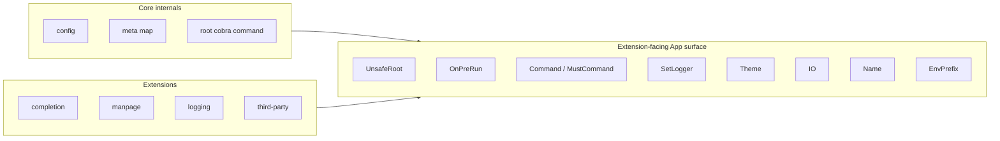

# Architecture

How Nabat is structured — the package layout, type responsibilities, and the
layers that connect them.

For the principles that drive these decisions, see
[Design Principles](design-principles.md). For the reasoning behind specific
choices, see [Design Decisions](design-decisions.md).

## Contents

- [Core + Extension Subpackages](#core--extension-subpackages)
- [Layer Diagram](#layer-diagram)
- [Extension Boundary](#extension-boundary)
- [Key Types](#key-types)
- [Type Relationships](#type-relationships)
- [Execution Lifecycle](#execution-lifecycle)
- [Arg Resolution Flow](#arg-resolution-flow)
- [Output System](#output-system)
- [Command Tree](#command-tree)
- [Built-in Help & Version](#built-in-help--version)
- [Opt-in Extensions](#opt-in-extensions)

## Core + Extension Subpackages

Nabat is split between a small **agnostic core** (the `nabat` package) and a set
of **opt-in extension subpackages** that build on the core's public extension
API.

| Package                     | Role                                                                                |
|-----------------------------|-------------------------------------------------------------------------------------|
| `nabat.dev`                 | Core: `App`, `Command`, `Context`, `Extension`, `IOStreams`, **built-in help, version, and shell completion**, output, prompts, value types. Resolves a `theme.Recipe` (typically a `theme.Theme` value) into the `theme.ResolvedTheme` returned by `App.Theme()`. |
| `nabat.dev/nabat/nabattest` | Test helpers nested under core (analogous to `net/http/httptest`): `NewIO`, `NewTTYIO`, `Run`, `RunParallel`. Not imported by production code. |
| `nabat.dev/theme`           | Leaf primitives + built-in catalog: `Theme` (data), `Palette`, `Recipe`, `Token`, `Capabilities`, `Variant`, `ResolvedTheme`, `Prompt`, `Override`, `Requirement` plus embedded DTCG JSON manifests, lazy `Get` / `Names` / `All` / `Schema` / `Manifest` registry, untyped name constants (`theme.Default`, `theme.Dracula`, …), and the closed catalog of bundled upstream `huh.Theme` wrappers (`charm`, `base16`, `dracula`, `catppuccin`). No imports from `nabat.dev`. |
| `nabat.dev/manpage`         | `man` subcommand (roff/man-page generation)                                         |
| `nabat.dev/logging`         | Styled `*slog.Logger` install with --verbose / --log-level flag wiring; derives its level / key=value styles from `theme.ResolvedTheme` via `logging.FromTheme`. |

The core is **agnostic about extensions**: it knows only the `Extension`
interface (`fmt.Stringer` + `Init(AppSurface) error`) and the `AppSurface` API
(`UnsafeRoot()`, `OnPreRun()`, `Theme()`, `SetLogger()`, `IO()` (the
`IOStreams` bundle), `Name()`, `EnvPrefix()`, `Command()`,
`MustCommand()`). The concrete `*App` type implements `AppSurface`, so the same
methods are available on the value users hold. Extensions call those methods to
install their behaviour. Third-party extensions use the same surface as
first-party extensions. On the `Command` side, `Command.UnsafeCobra()` is the
matching escape hatch for reaching the underlying `*cobra.Command` of any
subcommand.

Extensions are installed via the `WithExtension(ext)` Option passed to
`New(...)`; their `Init` runs inside `New` after the root command and core
features (help, version, completion) are wired up. Errors from an extension's
`Init` surface directly from `New(...)`.

This means:

- `nabat` itself imports zero extension packages — adding an extension does not
  pull in new code unless you import it.
- Each extension subpackage owns its `Option` type, its
  `New(opts...) nabat.Extension` constructor, and its install logic.
- Beginners pay no discovery cost — every extension call is
  `nabat.WithExtension(<package>.New(...))`, an English sentence.

Theme, help, version, and completion are the deliberate exceptions: theme stays
wired into core because every output path consults the `App.Theme()` accessor
(help, structured output, extension loggers all read from it). The theme
primitives, the built-in catalog, and the manifest parser all live in the
single `nabat.dev/theme` package (with the parser in
`theme/internal/manifest`). `App.New` is the place where a recipe is resolved
against detected `Capabilities` and pinned for the lifetime of the App. Help
and version stay in core because they need to install root-level flags (`--help`,
`--version`) — the only sanctioned way to do so. Completion stays in core
because the cobra completion machinery is already linked into every binary,
the dynamic-completer hooks (`WithCompleter`,
`WithPositionalCompleter`) live on flags and args that the core already owns,
and shell completion is a baseline CLI affordance (per [clig.dev](https://clig.dev/))
— making it an extension would force every CLI to wire the same boilerplate. See
[Help, version, and completion live in the core](design-decisions.md#help-version-and-completion-live-in-the-core)
for the full rationale.

## Layer Diagram

Nabat is structured in four layers. Each layer depends only on the layer below
it.

```text
┌──────────────────────────────────────────────────────────┐
│           Extensions (subpackages, opt-in)                │
│  completion, manpage, logging                             │
│  Each: Option type + New(opts...) nabat.Extension         │
│  (help and version are built into core, not subpackages)  │
├──────────────────────────────────────────────────────────┤
│                   Output & Interaction                    │
│  Semantic (Success, Warn, Error, Info, Print)             │
│  Structured (Table, List, Tree, JSON, YAML, TOML,        │
│    Encode, Highlight)                                     │
│  Progress (ProgressBar)                                   │
│  Interactive (Spinner, Confirm, Form)                     │
│  Custom help rendering (markdown via Glamour)             │
├──────────────────────────────────────────────────────────┤
│                Config, Command & Resolution               │
│  App config (functional options)                          │
│  Extension API (WithExtension, App.OnPreRun, App.Command, │
│    App.SetLogger)                                         │
│  Command config (functional options)                      │
│  Field config (positional args + flags)                   │
│  Adaptive arg resolution (arg→env→prompt→def, env if WithEnv) │
│  Flag resolution (flag→env→default, env if WithEnv)       │
│  Value types and validation                               │
├──────────────────────────────────────────────────────────┤
│                       Foundation                          │
│  Cobra (command tree, flag parsing, completions)          │
│  Lip Gloss (terminal styling)                             │
│  Glamour (markdown rendering)                             │
│  Huh (interactive prompts and forms)                      │
│  Chroma (syntax highlighting)                             │
│  colorprofile (TTY detection)                             │
│  x/term (terminal checks)                                 │
└──────────────────────────────────────────────────────────┘
```

## Extension Boundary

The architectural invariant that makes the extension system safe: extensions
reach core only through the public extension-facing surface on `App`. They never
touch core internals (the `meta` map, the root command's internals, the private
`config`).



Extensions install subcommands (via `App.Command`), register global hooks (via
`App.OnPreRun`), and may set the logger (via `App.SetLogger`). They MUST NOT
modify the root command or any command they did not create. Cross-cutting
concerns that need root flags belong in core (this is why help and version live
there). See
[Extensions cannot change existing commands](design-decisions.md#extensions-cannot-change-existing-commands)
for the rationale.

## Key Types

| Type           | What it does                                                                                                                                            |
|----------------|---------------------------------------------------------------------------------------------------------------------------------------------------------|
| `App`          | Root CLI application. Holds the Cobra root command, the `*commandSpec` map, and config. Entry point for `Command`, `MustCommand`, `Run`. |
| `Extension`    | `interface { fmt.Stringer; Init(AppSurface) error }` — the single extension point. Extensions are installed via the `WithExtension(ext)` Option passed to `New(...)` and run in declaration order inside `New`. `String()` identifies the extension in error messages. |
| `Command`      | One subcommand. Wraps a Cobra command with Nabat metadata (positional args, flags, run function). Supports nesting via `Command()` (returns `(*Command, error)`) or `MustCommand()` (panics on failure). |
| `Context`      | Per-invocation runtime passed to `RunFunc`. Holds Go context, resolved values, raw args, interactive state, the shared sticky-error writer, and every output/prompt method. `Logger()` reads from the App's installed logger or returns a discard logger. |
| `config`       | Private app config. Holds name, env prefix, theme, IO writers, the optional installed logger, the root command's `commandSpec` (`rootSpec`), pending declarative subcommand registrations (`pendingCommands`), and the optional error handler. Validated at construction. |
| `commandSpec`  | Private command spec. Single struct combining description, long description, example, aliases, group, hidden/deprecated markers, run function, flags, args, hooks, passthrough definition, parent pointer, parse and arity options, completion config, and pending child registrations from nested `WithCommand` calls. |
| `fieldConfig`  | Private field config shared by positional args and flags. Holds default, short, env-prefixed names (`envPrefixed`), env literal aliases (`envLiteral`), usage, required, and persistent (inherited) marker. |
| `argSpec` / `flagSpec` | Private build-time specs each option mutates. `argSpec` wraps `fieldConfig` plus `promptConfig`; `flagSpec` wraps only `fieldConfig`. Plain `func(*spec)` options edit them directly. |
| `ValueType`    | Type descriptor for args and flags. Identifies the kind (string, bool, int, float, select, etc.) and optional choice constraints. Each kind exposes a `valueAdapter` so flag registration / parsing is generic. |
| `theme.Theme`  | Declarative theme data: `Name`, `Default Variant`, `Variants map[Variant]Palette`, plus cross-variant defaults. Constructed inline (struct literal) or via `nabat.WithTheme(name)` (resolved through the catalog). `Theme.Resolve(Capabilities)` produces a `ResolvedTheme`. Implements `theme.Recipe`. |
| `theme.Recipe` | `interface { Resolve(Capabilities) ResolvedTheme }`. Escape hatch for themes whose palette choice depends on runtime capabilities in a way one Palette per Variant cannot express. `theme.Theme` satisfies it; bespoke recipes implement it directly. |
| `theme.Palette` | Per-variant style data: `Tokens`, `Aliases`, `Chroma`/`ChromaName`, `Glamour`/`GlamourName`/`GlamourFor`, `Prompt`, `Huh`. Each cascade slot (chroma, glamour, prompt) collapses at `Theme.Resolve` time. |
| `theme.ResolvedTheme` | Immutable, capability-aware result of `Theme.Resolve`. Consumers query it through `Style(token)` (with alias-chain fall-through), plus single-value accessors for `Chroma`, `Glamour`, `Huh`, `ListEnumerator`, `TableBorder`. Returned by `App.Theme()`. Thread-safe; never mutated after `App.New` returns. |
| `theme.Capabilities`  | Snapshot of terminal facts the framework detects once at `App.finalize` time: `Dark`, `BackgroundHex`, `Profile`, `Interactive`, `Width`, `Hyperlinks`, `Unicode`, `ReducedMotion`. Recipes branch on these to pick palettes that work on the terminal at hand. |
| `theme.Override`     | Per-Palette mutation produced by `theme.SetToken`/`SetAlias`/`SetChroma*`/`SetGlamour*`/`SetHuh`. Applied to every variant of the underlying theme via `Theme.With(...)` or `nabat.WithThemeOverride(...)` for one-line tweaks of a built-in theme. |
| `theme.Requirement`  | Token set declared by a consumer (core or extension via `ExtensionWithRequirements`). The framework cross-checks against the resolved theme at `App.finalize` and surfaces missing tokens (warn-by-default; hard error via `nabat.WithStrictThemeRequirements`). |
| `ConfigErrors` | Aggregated validation errors from config validation and declarative registration via `WithCommand`. Collects multiple issues into one error value, returned from `New`. |

**Bundled theme manifests (`theme/data/*.json`).** Brand colors for the built-in `nabat` theme track the canonical palette package (`palette/palette/nabat-dark.json` and `nabat-light.json`): each manifest primitive hex matches the palette `colors` entry with the same name. The manifest-only **`link` primitive** resolves through palette **`roles.link`** (same hex as the named garden swatch). **`text.link`** always references that dedicated primitive—not `status.info`—so hyperlink color is explicit in diffs. Every colored variant shares the same **`tokens` key set** as `theme/data/default.json` for its variant kind (`dark`, `light`, or `notty`); `TestBundledManifestTokenKeysMatchDefault` in `theme/manifest_token_keys_test.go` enforces key parity. Cross-repo verification runs when **`NABAT_PALETTE_ROOT`** points at a palette repository root (`TestNabatManifestHexMatchesPalette` in `theme/nabat_palette_parity_test.go`).

All five option families — `Option`, `RootOption`, `CommandOption`,
`ArgOption`, and `FlagOption` — are Go interfaces, so one value can satisfy
more than one slot when the combination is meaningful. Examples: `WithRequired()`,
`WithUsage(text)`, `WithEnv(name)`, and `WithEnvAlias(...)` each return
`interface { ArgOption; FlagOption }`. `WithHidden()` returns
`interface { CommandOption; FlagOption }`. `WithDeprecated(message, ...)`
returns the same union for commands and flags (positional args excluded —
cobra has no deprecation hook for them). Misuse on any other slot is a
compile-time error. The command-related types form a lattice:

```text
              Option            (passed to nabat.New)
                ▲
                │ every RootOption is also Option
                │
            RootOption          (subset valid on the root command)
                ▲
                │ every RootOption is also CommandOption
                │
           CommandOption        (every command-related option)
```

A `nabat.WithCommand(name, opts...)` value satisfies all three interfaces, so
the same call works as a top-level entry to `New(...)` or as a nested entry
inside another `WithCommand`. See
[One option type per target](design-decisions.md#one-option-type-per-target),
[`Option` is an interface, not a function type](design-decisions.md#option-is-an-interface-not-a-function-type),
and godoc on each constructor for the full surface.

## Type Relationships

```text
App
├── config (private, set via Option)
│   ├── name, envPrefix
│   ├── theme (theme.Recipe — the recipe set by WithTheme / WithCustomTheme; concrete is usually theme.Theme)
│   ├── themeOverrides ([]theme.Override — registered via WithThemeOverride / WithThemeOverrides)
│   ├── strictThemeRequirements (bool — promote requirement diagnostics to hard errors)
│   ├── resolvedTheme (theme.ResolvedTheme — populated once by config.finalize)
│   ├── logger (*slog.Logger; nil = discard)
│   ├── rootSpec (*commandSpec — the root command's spec, populated by RootOption values passed to New)
│   ├── pendingCommands ([]*commandReg — declarative subcommands from WithCommand at the New level)
│   ├── errorHandler (func(error); nil = default styled stderr)
│   └── io (*IOStreams — defaults to NewSystemIO())
├── root (*cobra.Command)
├── meta (map[*cobra.Command]*commandSpec)
│   └── commandSpec
│       ├── parent (*cobra.Command)
│       ├── description, longDescription, example
│       ├── aliases, group
│       ├── hidden, deprecatedCommand
│       ├── flags ([]flagDef)
│       │   └── flagDef { name, ValueType, fieldConfig }
│       ├── args ([]argDef)
│       │   └── argDef { name, valueType, fieldConfig, prompt }
│       ├── passthrough (*passthroughDef)
│       ├── preRun / validations / postRun (lifecycle hooks)
│       ├── parseOpts, arityOpts
│       ├── children ([]*commandReg — declarative nested commands from WithCommand inside this command's options)
│       └── run (RunFunc)
├── globalPreRun ([]func(*Context) error — registered via App.OnPreRun; fire before every command)
└── IO (*IOStreams — same instance as cfg.io; public field for plugins)

Extension = interface { fmt.Stringer; Init(AppSurface) error }
  (installed via WithExtension(ext); Init runs inside New; may call AppSurface.Command, OnPreRun, SetLogger.
   MUST NOT modify the root command or commands it did not create.)

Context (created per invocation)
├── ctx (context.Context — Go context from Run or testing.Run)
├── app (*App)
├── cmd (*cobra.Command)
├── IO (*IOStreams — same instance as App.IO)
├── logger (*slog.Logger — copied from App.cfg.logger, or nil → discard)
├── args ([]string — raw positional args)
├── passthroughArgs ([]string — args after "--"; nil when "--" absent)
├── values (map[string]any — resolved args + flags)
├── set (map[string]bool — true when value came from arg/env/prompt, not a default)
└── interactive (bool — IO.CanPrompt() at construction time)

IOStreams
├── In (io.Reader — raw input)
├── Out (io.Writer — colorprofile-wrapped stdout, preserves Fd())
├── ErrOut (io.Writer — colorprofile-wrapped stderr, preserves Fd())
├── Methods: IsStdinTTY/IsStdoutTTY/IsStderrTTY, SetXxxTTY (overrides for tests),
│            ColorEnabled, CanPrompt, TerminalWidth, Err (sticky), RawIn/RawOut/RawErrOut
└── Constructors: NewSystemIO() (os.Stdin/Stdout/Stderr), NewIO(in,out,err); nabattest.NewIO() returning bundle + 3 buffers
```

## Execution Lifecycle

When `App.Run(ctx)` is called, execution follows this sequence:

```text
App.Run(ctx)
│
├── 1. Re-attach RunE for all commands
│       Ensures globalPreRun hooks registered by extensions during Extend() are wired in
│
├── 2. Cobra executes (root.ExecuteContextC)
│       Parses os.Args (or args from RunArgs), matches a command, parses flags
│
└── 3. Nabat's RunE pipeline (per matched command)
        │
        ├── a. Build Context (newContext)
        │       Detect interactivity (TTY check on stdin + stdout)
        │       Resolve positional args (see Arg Resolution Flow below)
        │       Resolve flags including persistent flags from ancestors
        │       Create sticky-error writer for output
        │
        ├── b. Global preRun hooks (App.OnPreRun)
        │       Run each func(*Context) error in registration order
        │       If any returns ErrHandled → short-circuit with nil (success)
        │       Stop on first non-ErrHandled error
        │
        ├── c. Command preRun hooks
        │       Run each func(*Context) error in declaration order
        │       If any returns ErrHandled → short-circuit with nil (success)
        │       Stop on first non-ErrHandled error
        │
        ├── d. Validation hooks
        │       Run each func(*Context) error in declaration order; stop on first error
        │
        ├── e. Run handler (RunFunc)
        │       The user's command handler; receives the fully resolved Context
        │
        └── f. postRun hooks
                Run each func(*Context) error; first run-error takes precedence,
                but all postRun hooks execute regardless
```

On failure (except when help or version output was handled internally), `Run`
passes the error through the configured error handler (`WithErrorHandler`) or
prints a styled error message and a usage hint to stderr before returning the
error.

## Arg Resolution Flow

When a command runs, Nabat builds a `Context` by resolving all positional args
and flags.

### Positional arguments

For each arg defined on the command, Nabat tries sources in order:

```text
1. Positional arg  →  arg present at this position?  →  parse and use
         │ no
2. Environment var →  `WithEnv` set and env var set and non-empty?  →  parse and use
         │ no
3. Interactive prompt →  TTY and a WithXxxPrompt is attached?  →  prompt user
         │ no
4. Required check  →  `WithRequired()` set?            →  return error
         │ no
5. Constructor default →  `WithArg` / `WithSelectArg` / … `defaultVal` was given?  →  use default
         │ no
6. Skip            →  value stays absent from context
```

The constructor `defaultVal` is the only non-interactive fallback for
declarative args; see
[Design Decisions](design-decisions.md#defaultval-is-the-only-non-interactive-fallback-for-declarative-args).

Environment resolution is **opt-in** per field and split into two explicit
options:

- `WithEnv(name...)` — names get the configured `envPrefix` prepended after
  normalization (`some-key` → `MYAPP_SOME_KEY`).
- `WithEnvAlias(name...)` — verbatim names with no prefix, for legacy/external
  variables (e.g. `GITHUB_TOKEN`).

Position of the constructors does not matter. Resolution tries every `WithEnv`
entry first (in declaration order), then every `WithEnvAlias` entry; the first
non-empty value wins. The app's `envPrefix` defaults from the binary name and
can be set with `WithEnvPrefix`. `WithEnv` and `WithEnvAlias` are shared
helpers — a single value satisfies both `ArgOption` and `FlagOption`, so the
same call works on positional args and flags.

### Flags (named options)

Flags follow a simpler cascade:

```text
1. CLI flag    →  --name=value passed?       →  use typed value from Cobra
         │ no
2. Environment →  `WithEnv` set and env var set and non-empty? →  parse and use
         │ no
3. Default     →  constructor `defaultVal` on `WithFlag` / `WithSelectFlag` / …  →  use default
         │ no
4. Required    →  WithRequired() was set? →  return error
         │ no
5. Skip        →  value stays absent from context
```

Flags do not support interactive prompts. This is enforced at compile time:
`FlagOption` cannot be passed prompt-shaping options because they only exist as
`ArgOption`. The architectural reason is that the flag cascade deliberately
omits a prompt step; see
[Args and flags are different](design-decisions.md#args-and-flags-are-different).

`Context` implements `context.Context`, so handlers can use `c` directly for
cancellation, timeouts, and value propagation.

## Output System

The `Context` provides three categories of output, all flowing through one
sticky-error, color-aware writer per `Context`:

- **Semantic output** — methods that convey meaning with styled symbols
  (success, warn, error, info, print). Each accepts a message string and
  optional alternating key-value pairs.
- **Structured output** — methods for formatted data (tables, lists, trees, JSON
  / YAML / TOML, dynamic-format encoding, syntax highlighting, progress bars).
- **Diagnostic logging** — a standard `*slog.Logger` exposed via
  `Context.Logger()`. Install via `nabat.WithLogger(*slog.Logger)` (bring your
  own) or `nabat.WithExtension(logging.New(...))` (opinionated charm-styled
  logger with optional --verbose / --log-level flag wiring). Without either,
  `Context.Logger()` returns a discard logger.

### Terminal awareness

In a TTY, colors render. When piped, the `NoTTY` color profile strips escape
codes automatically. Semantic output, structured output, and progress bars all
share the same writer, so a single I/O failure surfaces consistently via the
writer's first-error semantics.

## Command Tree

Commands form a tree rooted at `App.root`. Nesting is unlimited.

The declarative form (preferred for static trees) declares the entire tree
inside `nabat.New(...)`:

```go
app, err := nabat.New("myctl",
    nabat.WithDescription("My CLI"),
    nabat.WithCommand("cluster",
        nabat.WithDescription("Cluster management"),
        nabat.WithCommand("create", nabat.WithRun(createHandler)),
    ),
)
```

The imperative form is for dynamic registration (loading from plugins,
runtime config) or `main()`-style chaining via `MustCommand`:

```go
app := nabat.MustNew("myctl")
cluster := app.MustCommand("cluster", nabat.WithDescription("Cluster management"))
cluster.MustCommand("create", nabat.WithRun(createHandler))

// Or with explicit error handling:
cluster, err := app.Command("cluster", nabat.WithDescription("Cluster management"))
if err != nil { return err }
```

Both forms ultimately call the same internal `newCommand` path: a Cobra command
is created, registered under the parent, and a `*commandSpec` entry is stored
in `App.meta`. The map (`map[*cobra.Command]*commandSpec`) is the bridge
between Cobra's command tree and Nabat's arg/flag/run definitions.

Flags marked with `WithPersistent()` are Cobra persistent flags: they apply to
the command where they are defined and to all of its descendants. Other flags
are local to that command only. Declare cross-cutting flags on the root by
passing them directly to `nabat.New(...)`:
`nabat.New("myctl", nabat.WithFlag("verbose", false, nabat.WithPersistent()), ...)`.

## Built-in Help & Version

Help and version live in the core because they must install root-level flags
(`--help`, `--version`). Extensions cannot modify the root command, so any
feature that needs a root flag belongs in core. See
[Help, version, and completion live in the core](design-decisions.md#help-version-and-completion-live-in-the-core)
for the full rationale.

- **Help** has a two-axis design:
  - The persistent `--help`/`-h` flag and the custom Nabat renderer install
    automatically during `nabat.New` / `nabat.MustNew` (GNU/POSIX convention).
    Configure with App-level `WithHelpFlagName`, `WithHelpShorthand`,
    `WithoutHelpFlag`, `WithoutHelpShorthand`.
  - The `help <subcmd>` subcommand is opt-in via `WithHelpCommand` (mirroring
    `WithVersion`) with a nested `WithHelpCommandName` for the name. Without
    `WithHelpCommand`, no subcommand is installed.
  - `WithoutHelp` opts out of the entire feature — see godoc.
- **Version** is opt-in: pass `nabat.WithVersion("1.2.3")` to `New` and the App
  grows a `version` subcommand and a `--version`/`-v` flag. Configure via nested
  `WithVersion*` / `WithoutVersion*` options — see godoc.
- **Completion** is opt-in: pass `nabat.WithCompletion()` to `New` and the App
  grows a `completion` subcommand with bash, zsh, fish, and PowerShell
  generators. Configure via nested `CompletionOption` values
  (`WithCompletionName`, `WithCompletionHidden`, `WithCompletionShells`) — see
  godoc. Per-flag and per-positional dynamic candidates use `WithCompleter` and
  `WithPositionalCompleter` respectively and work whether or not
  `WithCompletion` is enabled (Cobra's hidden `__complete` command is always
  linked).

## Opt-in Extensions

Nabat ships two first-party extensions as subpackages (`nabat.dev/manpage`,
`nabat.dev/logging`). Apps install them via
`nabat.WithExtension(<package>.New(...))`. Each extension's `Init` receives an
`AppSurface` and runs inside `New` after the root command and built-in help/version/completion are
wired.

Extensions use `App.OnPreRun()` to install global hooks and `App.Command()` to
add subcommands — the same public API available to third-party extensions. The
`ErrHandled` sentinel allows pre-run hooks to signal that the invocation has
been fully handled, short-circuiting the command handler. Built-in help and
version use the same hook mechanism internally for `--help` and `--version`
short-circuiting.
